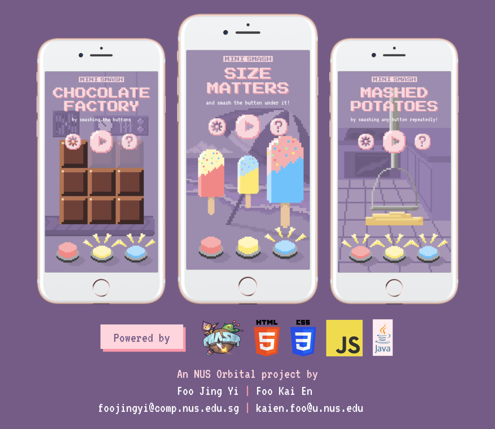

# Mini Smash

**Mini Smash** consists of three **HTML5** mini-games created with the game engine [Phaser](https://phaser.io/). Each mini-game
is played with only three buttons lasting around 30 seconds, making them easy to pick up and can be enjoyed guilt-free.

Click below to play:

**[Chocolate Factory](https://foo-j-foo-k.github.io/mini-smash-demo/mini-games/chocolate-factory/) |
[Mashed Potatoes](https://foo-j-foo-k.github.io/mini-smash-demo/mini-games/mashed-potatoes/) |
[Size Matters](https://foo-j-foo-k.github.io/mini-smash-demo/mini-game/size-matters/)**

